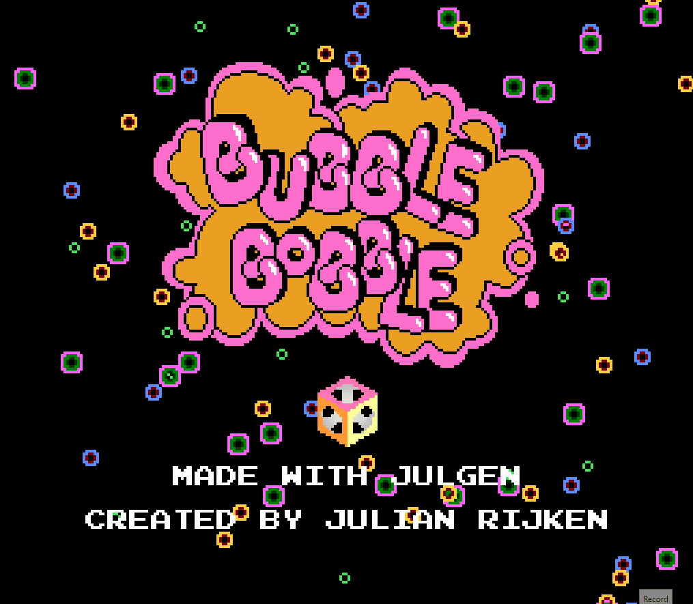

# Bubble Bobble

A fresh take on the [Original Game](https://en.wikipedia.org/wiki/Bubble_Bobble), taking inspiration from both the NES and arcade versions.

## Made With Julgen

Bubble Bobble is powered by [Julgen](https://github.com/JulianRijken/Julgen)

Julgen was originally developed for Bubble Bobble

## License
BubbleBubble is free software; you can redistribute it and/or modify it under the terms of the [GNU General Public License](LICENSE.md) as published by the Free Software Foundation; either version 3 of the License, or (at your option) any later version.
